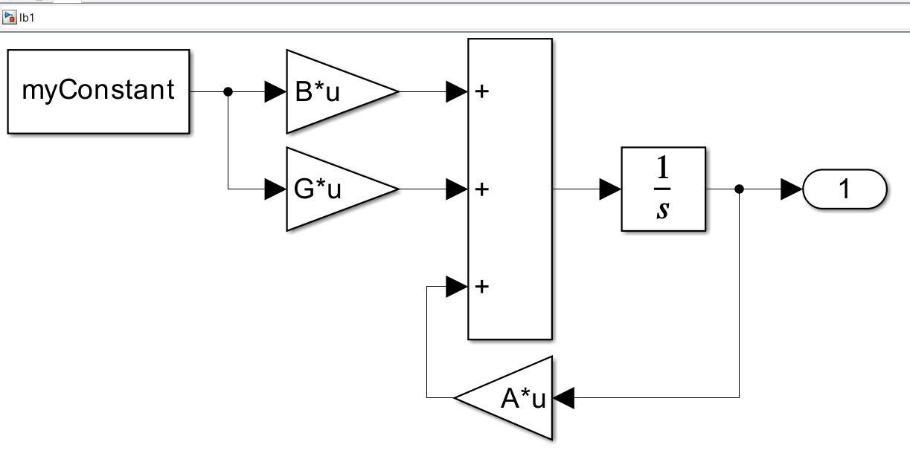
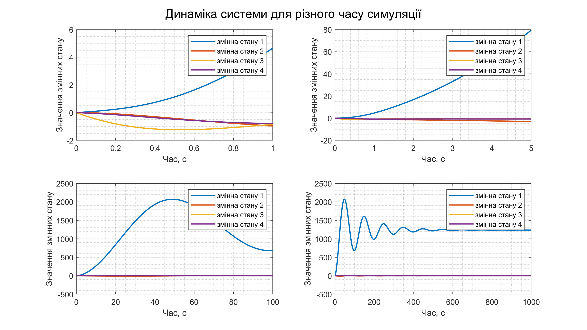
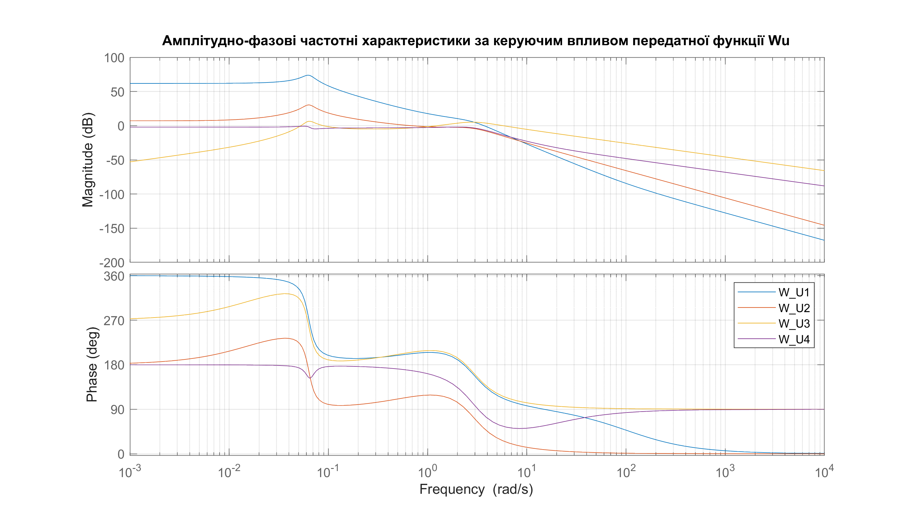

<div style="text-align:center; margin-top: 1cm;">
    <h2>Київський політехнічний інститут імені Ігоря Сікорського</h2>
    <h2>Приладобудівний факультет</h2>
    <h3>Кафедра автоматизації та систем неруйнівного контролю</h3>
    <br><br><br>
</div>

<div style="text-align:center; margin-top: 5cm;">
    <h2>Лабораторна робота № 1</h2>
    <h2>МОДЕЛЮВАННЯ ВЛАСНОГО РУХУ БАГАТОВИМІРНИХ СИСТЕМ АВТОМАТИЧНОГО КЕРУВАННЯ</h2>
</div>

<div style="text-align:right; margin-top: 5cm;">
<p>Студент: Погорєлов Богдан<br>
    Група: ПК-51мп<br>
</p>
</div>
<div style="text-align:center; margin-top: 5cm;">
2025 рік  <br><br><br><br>
</div>

# Мета роботи
набуття навичок комп’ютерного моделювання
багатовимірних систем автоматичного керування.


## Завдання на виконання лабораторної роботи:

1. Перетворити рівняння динаміки системи до форми простору станів.
2. Визначити повну матричну передатну функцію.
3. Провести аналіз стійкості розімкненої системи:
   3.1. За критерієм Гурвиця;
   3.2. Визначити корені характеристичного рівняння.
4. Побудувати графіки вільного руху розімкненої системи окремо для кожної
   змінної стану.
5. Визначити частотні характеристики розімкненої системи  $N(\omega)$ $\phi(\omega)$:
   5.1. Побудувати графіки асимптотичних логарифмічних частотних характеристик розімкненої системи;
   5.2. Побудувати графіки логарифмічних частотних характеристик розімкненої системи за формулами $L(\omega)$ $\phi(\omega)$;
   5.3. Побудувати графіки логарифмічних частотних характеристик розімкненої системи засобами Simulink.
6. Зробити висновки.

Параметри системи для варіанту 12 (Таблиця 1.1)

$$
l_1=0.017; l_2=9.8 ; l_3=8.52 ; a_0=0; a_1=1.15; a_2=6.86; \\
a_3=5.35; a_4=-1.293; a_5=0.39; a_6=-0.0005; a_7=0; a_{11}=0.5
$$

# Теоретичні відомості

Для математичного опису багатовимірних систем найчастіше застосовують рівняння динаміки у формі простору станів:

$$
\begin{cases}
\dot{X} = A \cdot X + B \cdot U + G \cdot L \\
Y = C \cdot X
\end{cases}
\ \ \ \ 
\text{де:}
$$

$$
X = \begin{bmatrix}
x_1 \\
x_2 \\
\vdots \\
x_n
\end{bmatrix}
\text{– вектор стану, що містить $n$ змінних стану;}
$$

$$
A = \begin{bmatrix}
a_{11} & a_{12} & \cdots & a_{1n} \\
a_{21} & a_{22} & \cdots & a_{2n} \\
\vdots & \vdots & \ddots & \vdots \\
a_{n1} & a_{n2} & \cdots & a_{nn}
\end{bmatrix}
\text{– матриця коефіцієнтів при змінних стану (матриця стану);}
$$

$$
U = \begin{bmatrix}
u_1 \\
u_2 \\
\vdots \\
u_m
\end{bmatrix}
\text{– вектор керування, що містить $m$ керуючих впливів;}
$$

$$
B = \begin{bmatrix}
b_{11} & b_{12} & \cdots & b_{1m} \\
b_{21} & b_{22} & \cdots & b_{2m} \\
\vdots & \vdots & \ddots & \vdots \\
b_{n1} & b_{n2} & \cdots & b_{nm}
\end{bmatrix}

\text{– матриця коефіцієнтів при векторі керування (матриця передачі керування);
}
$$

$$
L = \begin{bmatrix}
l_1 \\
l_2 \\
\vdots \\
l_r
\end{bmatrix}
\text{– вектор збурень, що містить r збурень;}
$$

$$
G = \begin{bmatrix}
g_{11} & g_{12} & \cdots & g_{1r} \\
g_{21} & g_{22} & \cdots & g_{2r} \\
\vdots & \vdots & \ddots & \vdots \\
g_{n1} & g_{n2} & \cdots & g_{nr}
\end{bmatrix}
\text{– матриця коефіцієнтів при векторі збурень (матриця передачі збурень);}
$$

$$
Y = \begin{bmatrix}
x_1 \\
x_2 \\
\vdots \\
x_q
\end{bmatrix}

\text{– вектор вимірюваних вихідних величин, що містить $q$ ($q \leq n$) змінних стану;
}
$$

$$
C = \begin{bmatrix}
1 & 0 & \cdots & 0 \\
0 & 1 & \cdots & 0 \\
\vdots & \vdots & \ddots & \vdots \\
0 & 0 & \cdots & 1
\end{bmatrix}
\text{– матриця вимірювання розмірності $q \times n$.}
$$

# Хід роботи

## 1. Перетворення рівнянь динаміки до форми простору станів
Першим етапом роботи є перетворення вихідної системи диференціальних рівнянь до форми простору станів, що дозволить отримати матричне представлення системи.

$$
\begin{cases}
\Delta \dot{V} + l_1\Delta V + l_3\Delta \alpha + l_2\Delta \Theta_T = f_x(t) \\
\Delta \dot{\Theta}_T + a_6\Delta V + a_4\Delta \alpha + a_7\Delta \Theta_T = a_5\Delta\delta_B + f_y(t) \\
\Delta \ddot{\Theta} + a_0\Delta V + a_1\Delta \dot{\Theta} + a_2\Delta \alpha + a_{11}\Delta \dot{\alpha} = -a_3\Delta\delta_B + f_{mz}(t) \\
\Delta \Theta = \Delta \Theta_T + \Delta \alpha
\end{cases}
$$

Вибір змінних стану:

$$
x_1 = \Delta V,\quad 
x_2 = \Delta \Theta,\quad 
x_3 = \Delta \dot{\Theta} = \dot{x}_2,\quad 
x_4 = \Delta \alpha
$$

Допоміжні співвідношення:

$$
\Delta \Theta_T = x_2 - x_4,\quad 
\Delta \dot{\Theta}_T = x_3 - x_4
$$

Керуючі впливи та збурення:

$$
U = \Delta \delta_B,\quad 
L = f_x
$$

$$
\begin{cases}
   \dot{x}_1 = L -l_1 x_1 -  l_3 x_4 + l_2(x_2-x_1)
\\ \dot{x}_2 = x_3
\\ \dot{x}_3= -a_3U-a_0 x_1 -a_1 x_3 -a_2 x_4 - a_{11}\dot{x}_4
\\ \dot{x}_4 = -a_5U + x_3 + a_6 x_1 + a_4 x_4 + a_7 (x_2 - x_4)
\end{cases}
$$

У матричній формі:

$$
\dot{X} = AX + BU + GL
$$

де:

$$
A = \begin{bmatrix}
-l_1 & -l_2 & -l_1 & l_2-l_3 \\
0 & 0 & 1 & 0 \\
-a_0-a_{11}a_6 & -a_{11}a_7 & -a_{11}-a_1 & -a_2-a_{11}(a_4-a_7)\\
a_6 & a_7 & 1 & a_4-a_7
\end{bmatrix},
\\
B = \begin{bmatrix}
0 \\ 0 \\ -a_3+a_5a_{11} \\ -a_5
\end{bmatrix},
\\
G = \begin{bmatrix}
1 \\ 0 \\ 0 \\ 0
\end{bmatrix}
$$

<!-- $$
pE-A = \begin{bmatrix}
p+l_1 & l_2 & 0 & -l_2+l_3 \\
0 & p & -1 & 0 \\
a_0+a_{11}a_6 & a_{11}a_7 & p+a_{11}+a_1 & a_2+a_{11}(a_4-a_7)\\
-a_6 & -a_7 & -1 & p-a_4+a_7
\end{bmatrix},
$$ -->

## 2. Визначення передатних функцій та аналіз стійкості
Наступним етапом є визначення передатних функцій системи та аналіз її стійкості різними методами.

Результат лістингу 1:

Передатна функція $W_U$ (за керуючим впливом):

$$
\left(\begin{array}{c} \frac{5\,\left(-8231300\,p^2+863380731\,p+831461400\right)}{100000000\,p^4+296000000\,p^3+839762525\,p^2+14514246\,p+3361400}\\ -\frac{5\,\left(103100000\,p^2+86595700\,p+1510811\right)}{100000000\,p^4+296000000\,p^3+839762525\,p^2+14514246\,p+3361400}\\ -\frac{5\,\left(103100000\,p^3+86595700\,p^2+1510811\,p\right)}{100000000\,p^4+296000000\,p^3+839762525\,p^2+14514246\,p+3361400}\\ -\frac{5\,\left(15600000\,p^3+232205200\,p^2+3944799\,p+1048600\right)}{2\,\left(100000000\,p^4+296000000\,p^3+839762525\,p^2+14514246\,p+3361400\right)} \end{array}\right)
$$

Передатна функція $W_L$ (за збуренням):

$$
\left(\begin{array}{c} \frac{5000\,\left(20000\,p^3+58860\,p^2+166939\,p\right)}{100000000\,p^4+296000000\,p^3+839762525\,p^2+14514246\,p+3361400}\\ \frac{1000\,\left(25\,p+343\right)}{100000000\,p^4+296000000\,p^3+839762525\,p^2+14514246\,p+3361400}\\ \frac{1000\,p\,\left(25\,p+343\right)}{100000000\,p^4+296000000\,p^3+839762525\,p^2+14514246\,p+3361400}\\ -\frac{2500\,p\,\left(20\,p+23\right)}{100000000\,p^4+296000000\,p^3+839762525\,p^2+14514246\,p+3361400} \end{array}\right)
$$

Характеристичний многочлен det(pI - A):

$$
p^4+\frac{74\,p^3}{25}+\frac{33590501\,p^2}{4000000}+\frac{7257123\,p}{50000000}+\frac{16807}{500000}
$$

Коефіцієнти :

$$
\begin{bmatrix}
1;        2.96;      8.3976;     0.14514;    0.033614 \\
\end{bmatrix}
$$

Корені характеристичного рівняння:

$$
\begin{bmatrix}
-1.472+2.4859i \\
-1.472-2.4859i \\
-0.0079845+0.062957i \\
-0.0079845-0.062957i \\
\end{bmatrix}
$$

## 3. Аналіз стійкості за критерієм Гурвиця
Для повного аналізу стійкості системи використовуємо критерій Гурвиця, який дозволяє оцінити стійкість без безпосереднього знаходження коренів характеристичного рівняння.

Критерій Гурвиця: Для характеристичного рівняння 4-го порядку:
p⁴ + 2.96p³ + 8.3976p² + 0.14514p + 0.033614 = 0

Визначимо головні діагональні мінори матриці Гурвиця:
- Δ₁ = a₃ = 2.96 > 0
- Δ₂ = a₃·a₂ - a₄·a₁ = 2.96·8.3976 - 0.14514·1 = 24.82 > 0  
- Δ₃ = a₃·(a₂·a₁ - a₀·a₃) - a₄·a₁² = 2.96·(8.3976·1 - 0.033614·2.96) - 0.14514·1 = 24.56 > 0
- Δ₄ = a₀·Δ₃ = 0.033614·24.56 > 0

Всі діагональні мінори додатні, що підтверджує стійкість системи за критерієм Гурвиця.


## 4. Моделювання в Simulink та аналіз перехідних процесів
Для експериментального дослідження поведінки системи було створено модель у середовищі Simulink.


<div style="text-align:center;">
Рис. 1 - Система Simulink
</div>

Виконаємо лістинг 2 та отримаємо значення змінних стану при різному часі симуляції. 


<div style="text-align:center;">
Рис. 2 - Значення змінних стану
</div>

Побудуємо графіки логарифмічних частотних характеристик розімкненої системи, для цього виконаємо лістинг 3.


<div style="text-align:center;">
Рис. 3 - ЛАЧХ та ЛФЧХ за керуючим впливом
</div>


<div style="text-align:right;">
Лістинг 1
</div>

```matlab
% lw1_1.m
run('lw1_params.m');

syms p
pE  = p * eye(4); % квадратна матриця 4 з діагоналлю p 
W_U = (pE - A)\B; % за керуючим впливом
W_L = (pE - A)\G; % за збуренням

charPoly = simplify(det(pE - A)); % символьний характеристичний многочлен
coeffs = sym2poly(charPoly);      % числовий вектор коефіцієнтів
coeffRoots = roots(coeffs);       % числовий вектор коренів

disp('Результат лістингу 1:');
disp('$$');
pprint('Передатна функція $W_U$ (за керуючим впливом)', W_U)
pprint('Передатна функція $W_L$ (за збуренням)', W_L)
pprint('Характеристичний многочлен det(pI - A)', charPoly);
pprint('Коефіцієнти ',  coeffs);
pprint('Корені характеристичного рівняння', coeffRoots)
disp('$$');

function pprint(title, M)
    % disp(title); % Для не латеху 
    % pretty(M) % Для не латеху
    disp(['\\[1em] \text{', title, ':}']);
    if isa(M, 'sym')
        disp(latex(M));
    else
        disp('\begin{bmatrix}');
        for i = 1:size(M,1)
            disp([num2str(M(i,:)), ' \\']);
        end
        disp('\end{bmatrix}');
    end
end
```

<div style="text-align:right;">
Лістинг 2
</div>

```matlab
% lw1_2.m

% Параметри для симуляції
run('lw1_params.m');
time_sim = [1, 5, 100, 1000];
x0 = [1; 0; 0; 0];
myConstant = 1;

figure('Position', [0, 0, 1920/2, 1080/2]); % бо не видно графіки норм


plotLegend = compose('змінна стану %d', 1:size(y_data,2));
for i = 1:length(time_sim)
    t_sim = time_sim(i);
    
    simLink = sim('lb1.slx', t_sim, simset('SrcWorkspace','current'));
    t = simLink.tout;
    y_data = simLink.yout{1}.Values.Data;
    
    subplot(2, 2, i);
    plot(t, y_data, 'LineWidth', 1.5);
    grid minor;
    legend(plotLegend);
    xlabel('Час, с');
    ylabel('Значення змінних стану');
end

sgtitle('Динаміка системи для різного часу симуляції');

drawnow;
print(gcf, [mfilename('fullpath') '.png'], '-dpng', '-r300');
close(gcf);
```

<div style="text-align:right;">
Лістинг 3
</div>

```matlab
% lw1_3.m
run('lw1_params.m');

s = tf('s'); % оператор Лапласа для функцій передачі простору станів
W_U_tf = (s*eye(4) - A)\B;

figure('Position', [0, 0, 1920/2, 1080/2]); % бо не видно графіки норм

bode(W_U_tf(1), W_U_tf(2), W_U_tf(3), W_U_tf(4));
legend('W_U1','W_U2','W_U3','W_U4');
grid on;
title('Амплітудно-фазові частотні характеристики за керуючим впливом передатної функції Wu');

drawnow;
print(gcf, [mfilename('fullpath') '.png'], '-dpng', '-r300');
close(gcf);
```


<div style="text-align:right;">
Лістинг 4
</div>

```matlab
% lw1_params.m

l_1  = 0.017;   l_2  = 9.8;    l_3  = 8.52;
a_0  = 0;       a_1  = 1.15;   a_2  = 6.86;
a_3  = 5.35;    a_4  = -1.293; a_5  = 0.39;
a_6  = -0.0005; a_7  = 0;      a_11 = 0.5;

A = [
    -l_1,          -l_2,       -l_1,      l_2-l_3;
    0,              0,         1,         0;
    -a_0-a_11*a_6, -a_11*a_7, -a_11-a_1, -a_2-a_11*(a_4-a_7);
    a_6,            a_7,       1,         a_4-a_7
];

B = [ 0 ; 0 ; -a_3+a_5*a_11 ; -a_5 ];

G = [ 1 ; 0 ; 0 ; 0 ];
```


# Висновки

В ході виконання лабораторної роботи було досліджено багатовимірну систему автоматичного керування та отримано практичні навички комп'ютерного моделювання таких систем.

Основні результати:

1. Система рівнянь динаміки була успішно перетворена до форми простору станів, що дозволило представити систему у компактній матричній формі з чітко визначеними матрицями стану A, керування B та збурень G.

2. Визначено повну матричну передатну функцію системи як за керуючим впливом, так і за збуренням, що характеризує динамічні властивості системи в частотній області.

3. Аналіз стійкості розімкненої системи показав, що система є стійкою, оскільки всі корені характеристичного рівняння мають від'ємні дійсні частини. Це підтверджується як критерієм Гурвиця, так і безпосереднім розрахунком коренів.

4. Побудовані графіки вільного руху системи демонструють перехідні процеси змінних стану. Аналіз цих графіків показує, що система має коливальний характер з затуханням, що відповідає отриманим комплексно-спряженим кореням з від'ємними дійсними частинами.

5. Частотні характеристики системи, побудовані різними методами, узгоджуються між собою та підтверджують отримані раніше результати. ЛАЧХ та ЛФЧХ демонструють характерні особливості системи четвертого порядку.

Отримані результати підтверджують коректність математичної моделі системи та ефективність використання MATLAB/Simulink для дослідження багатовимірних систем автоматичного керування.


#### Відповіді на контрольні питання

1. Рівняння динаміки - це математичний опис поведінки системи в часі, що зв'язує вхідні, вихідні величини та їх похідні. Воно описує, як змінюються стани системи під впливом зовнішніх впливів.

2. Форми запису рівнянь динаміки:
   - Диференціальні рівняння високого порядку
   - Форма простору станів (матрична форма)
   - Передатні функції
   - Імпульсно-перехідні характеристики

3. Матриця стану системи (A) - це квадратна матриця, що містить коефіцієнти при змінних стану в рівняннях динаміки. Вона визначає власну динаміку системи без урахування зовнішніх впливів.

4. Матриця передачі керування (B) - це матриця, що визначає вплив керуючих сигналів на швидкість зміни станів системи.

5. Матриця передачі збурень (G) - це матриця, що визначає вплив зовнішніх збурень на динаміку системи.

6. Передатна функція багатовимірної системи з рівнянь стану визначається за формулою: $W(p) = C(pI - A)⁻¹B + D$, де I - одинична матриця, p - оператор Лапласа.

7. Функції MATLAB для інтегрування звичайних диференціальних рівнянь:
   - `ode45` - для нежорстких систем
   - `ode23` - для систем з нижчою точністю
   - `ode113` - для систем з високою точністю
   - `ode15s` - для жорстких систем
   - `sim` - для моделей Simulink
   - також функції розв'язувачів для систем у формі простору станів