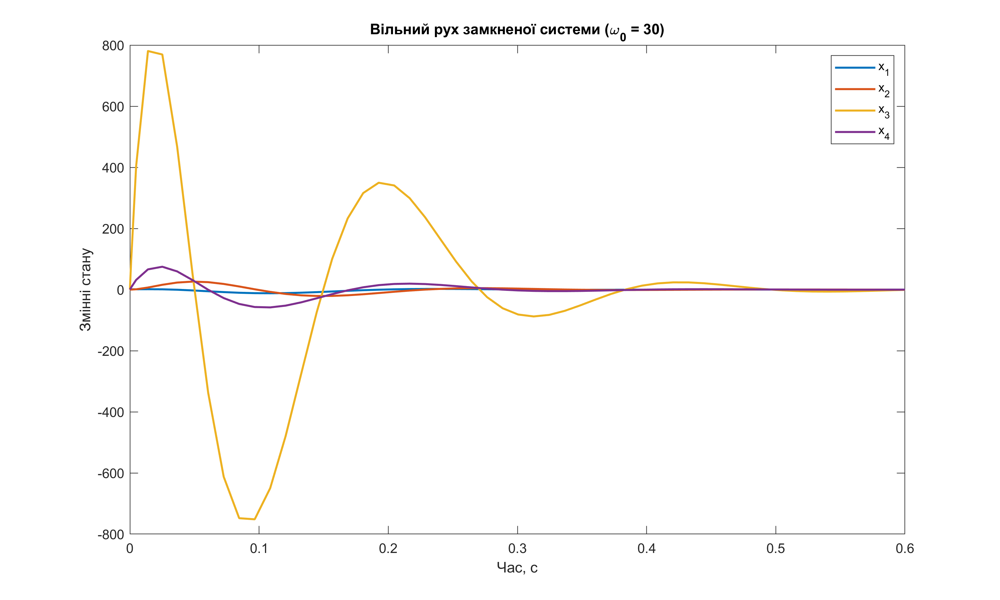
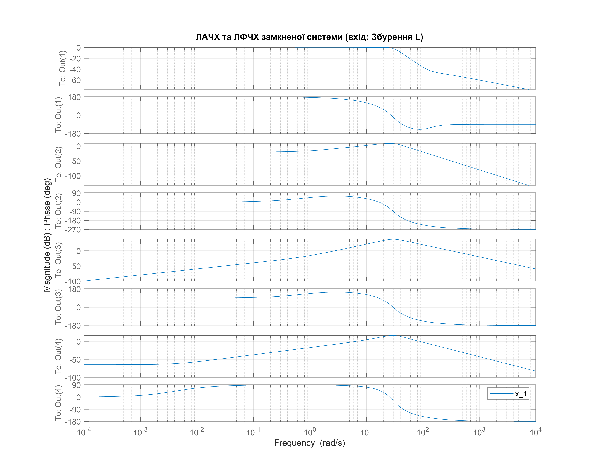

<div style="text-align:center; margin-top: 1cm;">
    <h2>Київський політехнічний інститут імені Ігоря Сікорського</h2>
    <h2>Приладобудівний факультет</h2>
    <h3>Кафедра автоматизації та систем неруйнівного контролю</h3>
    <br><br><br>
</div>

<div style="text-align:center; margin-top: 5cm;">
    <h2>Лабораторна робота № 2</h2>
    <h2>СИНТЕЗ МОДАЛЬНОГО РЕГУЛЯТОРА</h2>
</div>

<div style="text-align:right; margin-top: 5cm;">
<p>Студент: Погорєлов Богдан<br>
    Група: ПК-51мп<br>
</p>
</div>
<div style="text-align:center; margin-top: 5cm;">
2025 рік  <br><br><br><br>
</div>

# Мета роботи
Вивчення модальних регуляторів та методів їх синтезу.

## Завдання на виконання лабораторної роботи:

1. Перевірити умову повної керованості.
2. Визначити матрицю коефіцієнтів регулятора. Бажаний характеристичний поліном замкненої системи прийняти відповідно до індивідуального варіанту (Варіант 12).
3. Провести аналіз стійкості замкненої системи, визначивши корені характеристичного рівняння.
4. Побудувати графіки вільного руху замкненої системи з модальним регулятором окремо для кожної змінної стану.
5. Побудувати графіки логарифмічних частотних характеристик замкненої системи за передатною функцією замкненої системи по вхідному збуренню.
6. Зробити висновки.

### Індивідуальне завдання (Варіант 12)
* Власна частота: $\omega_0 = 30$ рад/с.
* Вид полінома: Поліном Батерворта.

# Теоретичні відомості

Задача модального керування полягає в розміщенні полюсів (коренів характеристичного рівняння) замкненої системи в заздалегідь заданих точках на комплексній площині.
Керування формується за законом:
$$
U = -H \cdot X
$$
де $H$ — матриця зворотного зв'язку.

Рівняння замкненої системи:
$$
\dot{X} = (A - BH)X + GL
$$

Для синтезу регулятора необхідно, щоб система була повністю керованою. Критерій керованості (ранг матриці Калмана):
$$
rank [B, AB, A^2B, ..., A^{n-1}B] = n
$$

# Хід роботи

<div style="text-align:right;"> Лістинг 1: Розрахунок регулятора </div>

```matlab
% lw2_1.m
run('../1/lw1_params.m'); % Завантаження A, B, G з 1-ї лаби

Qc = ctrb(A, B);
rank_Qc = rank(Qc);

fprintf('Ранг матриці керованості: %d\n', rank_Qc);
if rank_Qc == size(A, 1)
    disp('Система повністю керована.');
else
    disp('Система некерована!');
end

w0 = 30;
% Поліном Батерворта 4-го порядку:
des_coeffs = [1, 2.6*w0, 3.4*w0^2, 2.6*w0^3, w0^4];
des_poles = roots(des_coeffs);

% Розрахунок матриці H (формула Аккермана)
H = acker(A, B, des_poles); 

disp('Бажані полюси:');
disp(des_poles);

disp('Розрахована матриця регулятора H:');
disp(H);

% 3. Перевірка коренів замкненої системи
A_new = A - B*H; 
closed_loop_poles = eig(A_new);

disp('Полюси замкненої системи (перевірка):');
disp(closed_loop_poles);

% Ранг матриці керованості: 4
% Система повністю керована.
% Бажані полюси:
%  -11.4223 +27.7404i
%  -11.4223 -27.7404i
%  -27.5777 +11.8097i
%  -27.5777 -11.8097i
% Розрахована матриця регулятора H:
%    1.0e+05 *
%     0.1971    1.8404    0.1324   -1.7523
% Полюси замкненої системи (перевірка):
%  -11.4223 +27.7404i
%  -11.4223 -27.7404i
%  -27.5777 +11.8097i
%  -27.5777 -11.8097i
```

## 1. Перевірка умови повної керованості

Система має порядок $n=4$. Для перевірки керованості було складено матрицю керованості $Q_K$ та обчислено її ранг засобами MATLAB.

Результат виконання скрипту:
> Ранг матриці керованості: 4

Висновок: Ранг матриці дорівнює порядку системи ($n=4$), отже, система є повністю керованою. Синтез модального регулятора можливий.

## 2. Розрахунок модального регулятора

Для забезпечення заданих динамічних властивостей використовується стандартний поліном Батерворта 4-го порядку:
$$D_0(p) = p^4 + 2.6\omega_0 p^3 + 3.4\omega_0^2 p^2 + 2.6\omega_0^3 p + \omega_0^4$$

При $\omega_0 = 30$ бажані полюси системи дорівнюють кореням цього полінома:

$$
p_{1,2} = -11.42 \pm 27.74i \\
p_{3,4} = -27.58 \pm 11.81i
$$

Розрахована матриця коефіцієнтів регулятора $H$ (методом Аккермана):

$$
H = \begin{bmatrix}
1.971 \cdot 10^4 & 1.840 \cdot 10^5 & 1.324 \cdot 10^4 & -1.752 \cdot 10^5
\end{bmatrix}
$$

## 3. Аналіз стійкості

Перевірка власних чисел матриці замкненої системи $(A - BH)$ показала, що вони точно збігаються з бажаними полюсами Батерворта. Оскільки всі дійсні частини коренів від'ємні ($\text{Re}(p_i) < 0$), замкнена система є асимптотично стійкою.

## 4. Моделювання в Simulink

Для дослідження динаміки було розроблено імітаційну модель в середовищі Simulink. Схема включає контур зворотного зв'язку з розрахованою матрицею $H$.


<div style="text-align:center;">
Рис. 1 - Схема Simulink
</div>

Результати моделювання вільного руху системи (реакція на початкові умови $X_0 = [1, 0, 0, 0]$):

<div style="text-align:right;"> Лістинг 2 </div>

```matlab
% lw2_2.m
evalc('run("lw2_1.m")'); 

t_sim = '0.6';      % Час симуляції
x0 = [1; 0; 0; 0];  % Початкові умови

simOut = sim('lb2', 'StartTime', '0', 'StopTime', t_sim);

signalVal = simOut.yout{1}.Values;
y_data = signalVal.Data;
t = signalVal.Time;

f = figure('Position', [100, 100, 1000, 600]);
plot(t, y_data, 'LineWidth', 1.5);
legend('x_1', 'x_2', 'x_3', 'x_4');
title(['Вільний рух замкненої системи (\omega_0 = ' num2str(w0) ')']);
xlabel('Час, с');
ylabel('Змінні стану');

print(f, [mfilename('fullpath') '.png'], '-dpng', '-r300');
close(f);
```


<div style="text-align:center;">
Рис. 2 - Графіки вільного руху змінних стану замкненої системи
</div>

Графіки демонструють швидке затухання перехідного процесу (приблизно за 0.25 с), що відповідає високій власній частоті $\omega_0 = 30$. Процес має аперіодичний характер з незначним перерегулюванням, що властиво налаштуванню за Батервортом.

## 5. Частотні характеристики

Побудовано логарифмічні амплітудні (ЛАЧХ) та фазові (ЛФЧХ) частотні характеристики замкненої системи по каналу збурення ($L \to X$).

<div style="text-align:right;"> Лістинг 3:</div>

```matlab
% lw2_3.m
evalc('run("lw2_1.m")');

% Передатна функція замкненої системи по збуренню
% W_L_cl = (sI - (A-BH))^-1 * G
sys_closed_dist = ss(A_new, G, eye(4), 0);

f = figure('Position', [0, 0, 1000, 800]);
bode(sys_closed_dist); 
grid on;
title('ЛАЧХ та ЛФЧХ замкненої системи (вхід: Збурення L)');
legend('x_1', 'x_2', 'x_3', 'x_4');

drawnow;
print(gcf, [mfilename('fullpath') '.png'], '-dpng', '-r300');
close(f);
```


<div style="text-align:center;">
Рис. 3 - Частотні характеристики замкненої системи по збуренню
</div>

Частотні характеристики показують, що система ефективно фільтрує низькочастотні збурення.

# Висновки

У ході лабораторної роботи було виконано синтез системи модального керування для об'єкта 4-го порядку.

1.  Підтверджено повну керованість вихідної системи.
2.  Розраховано коефіцієнти зворотного зв'язку $H$, які забезпечують розташування полюсів системи відповідно до полінома Батерворта з частотою $\omega_0 = 30$ рад/с.
3.  Моделювання підтвердило правильність розрахунків: система є стійкою, а час перехідного процесу значно скоротився порівняно з розімкненою системою (з Лаб. №1).
4.  Використання полінома Батерворта дозволило досягти оптимального компромісу між швидкодією та коливальністю перехідного процесу.