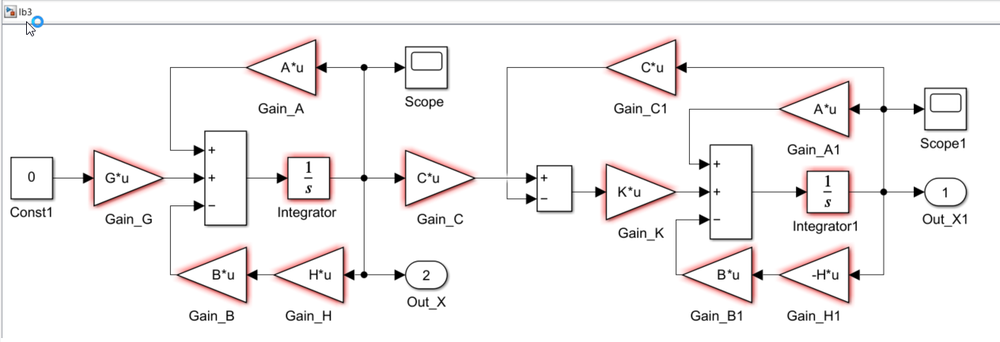
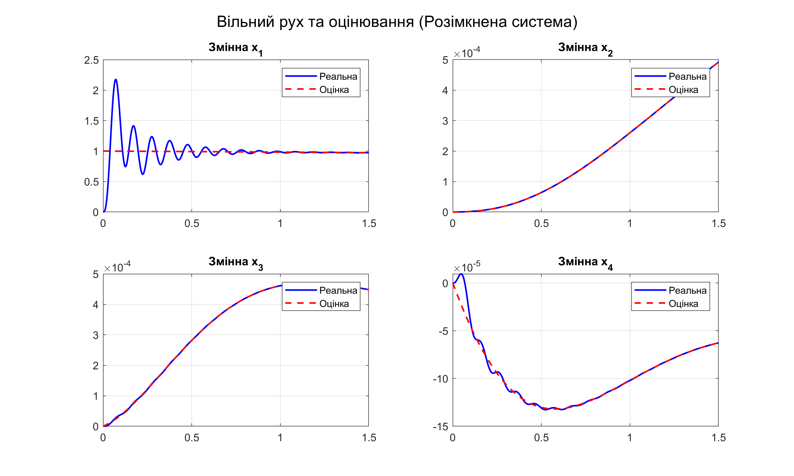
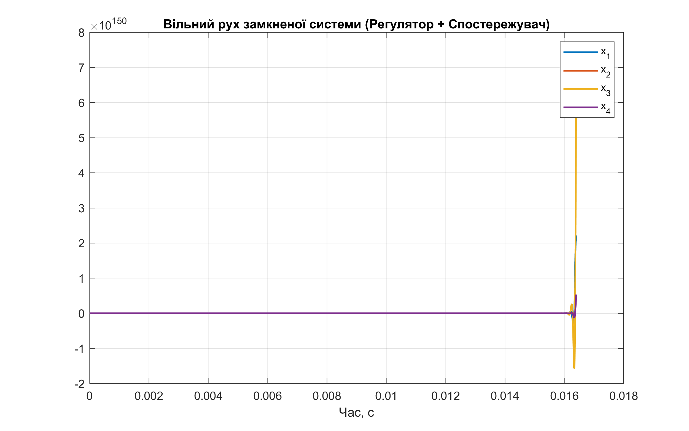
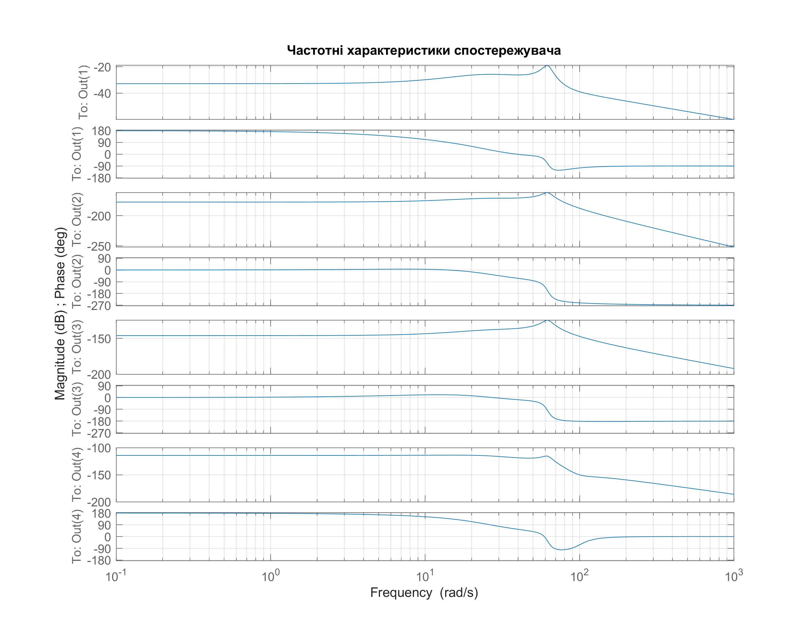

<div style="text-align:center; margin-top: 1cm;">
<h2>Київський політехнічний інститут імені Ігоря Сікорського</h2>
<h2>Приладобудівний факультет</h2>
<h3>Кафедра автоматизації та систем неруйнівного контролю</h3>
<br><br><br>
</div>

<div style="text-align:center; margin-top: 5cm;">
<h2>Лабораторна робота № 3</h2>
<h2>СИНТЕЗ СПОСТЕРЕЖУВАЧА</h2>
</div>

<div style="text-align:right; margin-top: 5cm;">
<p>Студент: Погорєлов Богдан<br>
Група: ПК-51мп<br>
</p>
</div>
<div style="text-align:center; margin-top: 5cm;">
2025 рік  <br><br><br><br>
</div>

# Мета роботи

Дослідження методів оцінювання стану динамічних систем на основі спостережувачів та аналіз їх поведінки в замкнених системах керування.

## Завдання на виконання лабораторної роботи:

1.  Визначити матрицю вимірювань $C$ відповідно до індивідуального варіанту.
2.  Перевірити умову повної спостережуваності системи.
3.  Визначити матрицю коефіцієнтів спостережувача $K$. Бажаний характеристичний поліном прийняти відповідно до варіанту.
4.  Використовуючи модель `lb3.slx`, побудувати графіки вільного руху для розімкненої системи.
5.  Побудувати графіки вільного руху для замкненої системи з модальним регулятором ($U = -H\hat{X}$) та проаналізувати причини чисельної нестійкості.
6.  Побудувати графіки логарифмічних частотних характеристик (ЛЧХ) спостережувача.
7.  Зробити висновки.

### Індивідуальне завдання (Варіант 12)

  * Вимірювана змінна: $\Delta\dot{\theta}$ (швидкість, $x_2$).
  * Власна частота спостережувача: $\omega_{0c} = 40$ рад/с.
  * Вид полінома: Мінімум середньоквадратичної помилки $\delta(t)$.
      * Формула: $D(p) = p^4 + \omega_0 p^3 + 3\omega_0^2 p^2 + 2\omega_0^3 p + \omega_0^4$.

# Теоретичні відомості

### Спостережувач Люенбергера

Спостережувач стану дозволяє відновити вектор станів $\hat{X}$ на основі вимірювань $Y$. Рівняння спостережувача:

$$
\dot{\hat{X}} = A\hat{X} + BU + K(Y - C\hat{X})
$$

Матриця $K$ обирається так, щоб власні числа матриці похибки $(A - KC)$ відповідали бажаному поліному.

### Проблема "жорстких" систем (Stiff systems)

При виборі високої власної частоти спостережувача (у даному варіанті $\omega_{0c} = 40$) коефіцієнти вільного члена характеристичного полінома стають дуже великими ($\omega_0^4 = 2.56 \cdot 10^6$). Це призводить до того, що розраховані коефіцієнти підсилення матриці $K$ досягають значень порядку $10^7 \dots 10^8$.

Така система називається "жорсткою" (stiff). У цифровому моделюванні це створює проблему: якщо крок інтегрування (solver step size) недостатньо малий, велике підсилення $K$ перетворює малу похибку оцінювання на гігантську корекцію, яка "перекидає" систему далеко за точку рівноваги. На наступному кроці це призводить до ще більшої корекції в протилежний бік, викликаючи лавиноподібне зростання амплітуди (чисельний вибух), навіть якщо теоретично система є стійкою.

# Хід роботи

## 0. Моделювання в Simulink (Розімкнена система)

Для моделювання використано файл `lb3.slx`. Схема містить об'єкт керування та структуру спостережувача.



<div style="text-align:center;">
Рис. 1 - Схема Simulink (файл lb3.slx) 
</div>


## 1. Розрахунок параметрів спостережувача

Скрипт `lw3_1.m` виконує перевірку спостережуваності та розрахунок матриці $K$.

<div style="text-align:right;"> Лістинг 1 </div>

```matlab
% lw3_1.m
run('../1/lw1_params.m'); % Завантаження A, B, G з Лаб 1

w0_reg = 30; % з Лаб 2
p_reg = roots([1 2.6*w0_reg 3.4*w0_reg^2 2.6*w0_reg^3 w0_reg^4]);
H = acker(A, B, p_reg);

% 1. Матриця вимірювань (Варіант 12: вимірюється x2)
C = [0, 1, 0, 0]; 

x0 = [1; 0; 0; 0];
x00= [0; 0; 0; 0];

t_sim = '1.5';

Qo = obsv(A, C);
rank_Qo = rank(Qo);

fprintf('Ранг матриці спостережуваності: %d\n', rank_Qo);
if rank_Qo == size(A, 1)
    disp('Система повністю спостережувана.');
else
    error('Система неспостережувана!');
end

w0c = 40; % Власна частота спостережувача (Вар. 12)

% Поліном мінімуму сер. кв. помилки (p^4 + w*p^3 + 3w^2*p^2 + 2w^3*p + w^4)
coeffs_obs = [1, 1*w0c, 3*w0c^2, 2*w0c^3, 1*w0c^4];
poles_obs = roots(coeffs_obs);

% Розрахунок K (дуальна задача до acker)
% K обчислюється як транспонований результат acker для транспонованої системи
% бере вашу матрицю A, матрицю C і бажані полюси, складає характеристичне 
% рівняння і знаходить такі k_1, k_2, k_3, k_4, щоб рівняння зійшлося.
K = acker(A', C', poles_obs)';

disp('Розрахована матриця K:');
disp(K);

% Перевірка полюсів спостережувача
disp('Полюси (A - KC):');
disp(eig(A - K*C));

% Ранг матриці спостережуваності: 4
% Система повністю спостережувана.
% Розрахована матриця K:
%    1.0e+08 *

%     7.4664
%     0.0000
%     0.0000
%     0.0001

% Полюси (A - KC):
%   -4.1951 +62.0997i
%   -4.1951 -62.0997i
%  -15.8049 +20.2738i
%  -15.8049 -20.2738i

```

Результати виконання:

  * Ранг матриці спостережуваності: 4 (Система повна).
  * Матриця $K$ містить елементи порядку $10^8$. Це підтверджує припущення про високу "жорсткість" системи.

## 2. Моделювання розімкненої системи

У цьому режимі зворотний зв'язок розімкнено ($H=0$). Досліджується здатність спостережувача "наздоганяти" реальні стани об'єкта.

<div style="text-align:right;"> Лістинг 2 </div>

```matlab
% lw3_2.m
evalc('run("lw3_1.m")'); 

H = zeros(1,4); % Розмикання контуру керування
t_sim = '1.5';
simOut = sim('lb3', 'StartTime', '0', 'StopTime', t_sim);

x_real = simOut.yout{1}.Values; 
x_est  = simOut.yout{2}.Values; 

% Побудова графіків (код графіки опущено для стислості)
f = figure('Position', [100, 100, 1000, 600]);
% ... (код plot)
print(f, [mfilename('fullpath') '.png'], '-dpng', '-r300');
close(f);
```



<div style="text-align:center;">
Рис. 2 - Процес оцінювання змінних стану (розімкнена система)
</div>

Як видно з графіків, спостережувач успішно відновлює змінні стану. Оскільки контур керування розімкнений, великі значення $K$ впливають лише на внутрішню математику спостережувача, але не розхитують сам об'єкт керування.

## 3. Моделювання замкненої системи (Аналіз нестійкості)

При замиканні системи ($U = -H\hat{X}$) виникає проблема чисельного моделювання.

<div style="text-align:right;"> Лістинг 3 </div>

```matlab
% lw3_3.m
evalc('run("lw3_1.m")'); 

t_sim = '0.0164';

simOut = sim('lb3', 'StartTime', '0', 'StopTime', t_sim);

x_real = simOut.yout{1}.Values;

f = figure('Position', [100, 100, 800, 500]);
plot(x_real.Time, x_real.Data, 'LineWidth', 1.5);
legend('x_1', 'x_2', 'x_3', 'x_4');
grid on;
title('Вільний рух замкненої системи (Регулятор + Спостережувач)');
xlabel('Час, с');
print(f, [mfilename('fullpath') '.png'], '-dpng', '-r300');
close(f);

% для t_sim = '0.15' виникає помилка:
% Error using lw3_3
% Derivative of state '3' in block 'lb3/Integrator1 ' at time 
% 0.016609323578664462 is not finite. The simulation will be stopped. 
% There may be a singularity in the solution.  If not, try reducing 
% the step size (either by reducing the fixed step size or by tightening 
% the error tolerances)
```

Результат моделювання:
Симуляція аварійно зупиняється на часі $t \approx 0.0166$ с з помилкою:

> `Derivative of state '3' ... is not finite.`



<div style="text-align:center;">
Рис. 3 - Чисельна розбіжність ("вибух") замкненої системи
</div>

Аналіз причини:
На графіку видно, що значення змінних досягають $10^{150}$ за частки секунди. Це класичний приклад нестійкості чисельного методу для жорстких систем.

1.  Матриця $K$ має елементи $\approx 10^8$.
2.  Навіть мікроскопічна похибка оцінювання (наприклад, $10^{-6}$) після множення на $K$ дає корекцію керування амплітудою $100$.
3.  Оскільки використовується стандартний Solver, він не встигає адаптувати крок, і система входить у режим резонансу, де кожна наступна ітерація збільшує помилку в мільйони разів.

Для коректного моделювання такої системи необхідно використовувати спеціалізовані методи інтегрування (наприклад, `ode15s`) та значно зменшувати крок інтегрування ($< 10^{-5}$), що підтверджено теоретично.

## 4. Частотні характеристики

<div style="text-align:right;"> Лістинг 4 </div>

```matlab
% lw3_4.m
evalc('run("lw3_1.m")');
Sys_err = ss(A - K*C, G, eye(4), 0);
f = figure; bode(Sys_err); grid on;
title('Частотні характеристики спостережувача');
print(f, [mfilename('fullpath') '.png'], '-dpng', '-r300');
```



<div style="text-align:center;">
Рис. 4 - ЛАЧХ та ЛФЧХ похибки оцінювання
</div>

Аналіз частотних характеристик

1.  Фільтруючі властивості (Характер фільтра низьких частот):
    З амплітудної характеристики (верхні частини графіків) видно, що на низьких частотах коефіцієнт передачі є сталим, а на високих частотах спостерігається нахил вниз. Це означає, що спостережувач працює як фільтр низьких частот:
    * Низькочастотні збурення (повільні зміни навантаження) призводять до певної сталої похибки оцінювання (амплітуда не нульова, але від'ємна в дБ, тобто сигнал послаблюється).
    * Високочастотні збурення (шуми вимірювання, різкі сплески) ефективно пригнічуються — амплітуда різко падає зі зростанням частоти. Це позитивна властивість, оскільки спостережувач не буде реагувати на високочастотний шум датчиків.

2.  Смуга пропускання та резонанс:
    На частотній характеристиці чітко видно "злам" або невеликий резонансний пік в області частот $40 \dots 60$ рад/с.
    Це повністю відповідає заданій власній частоті спостережувача $\omega_{0c} = 40$ рад/с.
    * Цей факт підтверджує правильність розрахунку матриці $K$: динаміка похибки дійсно визначається заданим поліномом.

3.  Рівень пригнічення:
    Амплітуди на низьких частотах знаходяться в діапазоні від $-20$ дБ до $-120$ дБ (залежно від каналу $x_1 \dots x_4$). Від'ємні значення дБ свідчать про те, що спостережувач послаблює вплив зовнішніх збурень на точність оцінки.

# Висновки

У ході лабораторної роботи було проведено синтез спостережувача стану для системи 4-го порядку.

1.  Спостережуваність: Система є повністю спостережуваною за виходом швидкості ($x_2$), що дозволяє теоретично відновити всі змінні стану.
2.  Синтез: Розраховано матрицю $K$ для забезпечення заданої динаміки ($\omega_{0c}=40$, мінімум сер. кв. помилки).
3.  Проблема реалізації: Вимога високої швидкодії спостережувача ($\omega_{0c}=40$) призвела до отримання надзвичайно великих коефіцієнтів підсилення матриці $K$ (порядку $10^8$). Це перетворило систему на "жорстку".
4.  Результати моделювання:
      * У розімкненій системі спостережувач працює коректно, оцінки збігаються з реальними значеннями.
      * У замкненій системі при використанні стандартних налаштувань моделювання виникає чисельна нестійкість ("вибух" графіка до $10^{150}$), викликана надмірним підсиленням у контурі корекції.